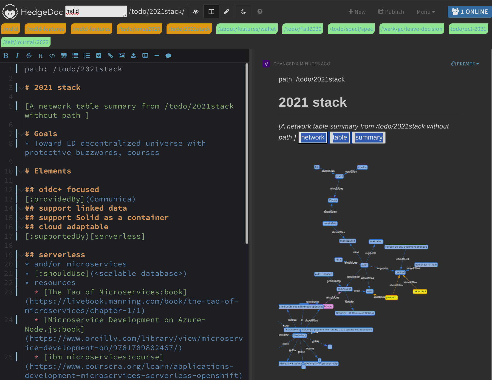

This is a working PoC of using Markdown with versatile quads (subject, predicate, object, source).
Its working name is mdld,
and it's intended to enable using data in notes as a database.
It's based on ideas from Semantic Mediawiki and Linked Data, 
using minor changes to Hedgedoc 1.6 for all it offers (a lot!).

The work is mainly in the directory mdld, with very minor, 
encapsulated changes to the Hedgedoc code base (about ten lines of Javascript).

What does it add?

* Markdown can be used to create data, using the format `[tag:predicate](value)`
  * If no tag is used, the subject is the page, otherwise it's sort-of anonymous resource (in progress)
* the ability to organize notes by a path `[:path](/some/path/title)`
  * links are mapped to paths
* The ability to query data 
  * the query syntax is English-like
    * see mdld/src/finder.tests.ts for examples
  * currently, table, count, network graph, gantt chart, and summary output are supported; these are derived from marked up data, they are not hard coded, so they update as the data is updated
  * reusable concepts can also be created
  * this is especially useful for project-specific to-dos and definitions within a larger collection of notes
* The ability to search by quads, server text, and path elements using a hotkey or the document path

The quad "database" is in-memory, on the server and the browser, 
so it can only handle thousands of notes / quads without slowing down or exploding.
However, since it runs "alongside" Hedgedoc, the risk it will corrupt data is low.

As it is, I find it priceless for my own work, but there is lots more to do. 
I am hoping to adapt it to HedgeDoc 2, as it emerges.



Happy to hear from anyone interested. 
Thank you.

## Setup mdld

Check out this repo, cd to it, then;
```
$ npm install
$ cd mdld
$ npm install
$ npm run tsc-watch
```
in another terminal
```
$ npm test
```


## Using it with Hedgedoc

That's the thing, I had to hack a few lines of core Hedgedoc to make this work, so have held back to v1.6. Am hoping Hedgedoc 2.0 (or something similar) will have some sort of compatible "extension" system.
